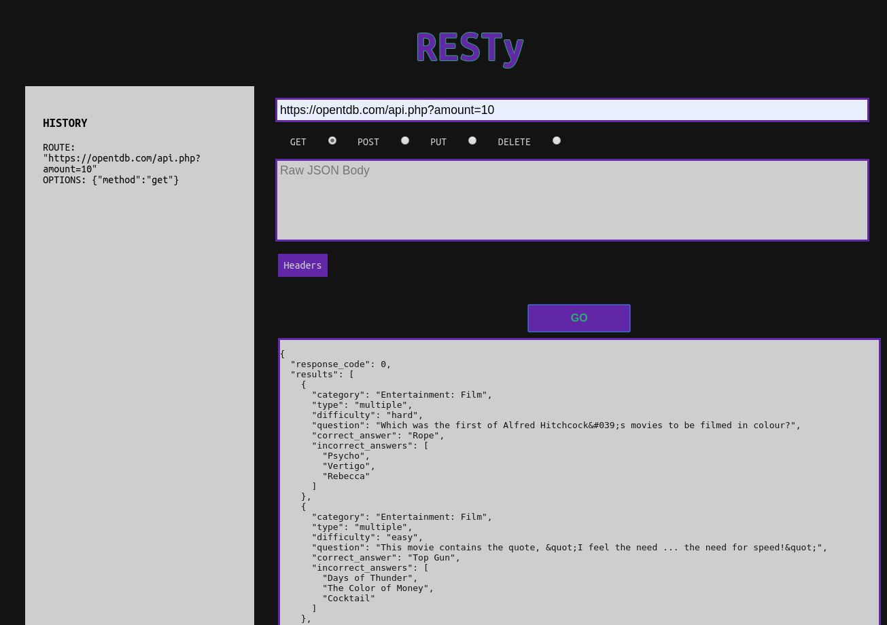

# A Postman-like app for hitting API servers.
### built on React.

## To start:

`npm install`

`npm start`

Or visit the development deployment located here: https://cryptic-brook-75726.herokuapp.com/

Preview of the app:

## Dependencies: 

"btoa": "^1.2.1",

"enzyme": "latest",

"enzyme-adapter-react-16": "1.14.0",

"jsonview": "^1.2.0",

"node-sass": "^4.13.1",

"react": "16.9.0",

"react-dom": "16.9.0",

"react-json-pretty": "^2.2.0",

"react-jsonschema-form": "1.8.0",

"react-router-dom": "5.0.1",

"react-scripts": "^3.4.0",

"react-test-renderer": "16.9.0"
